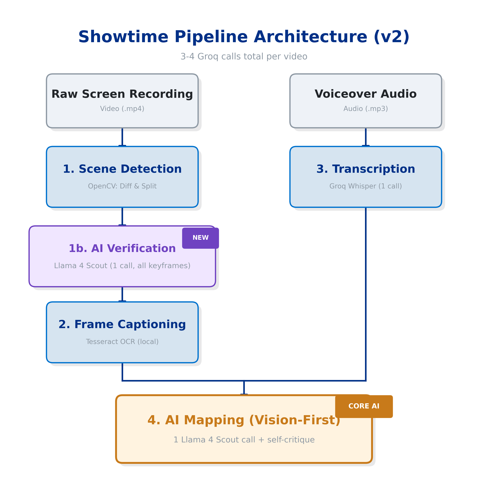
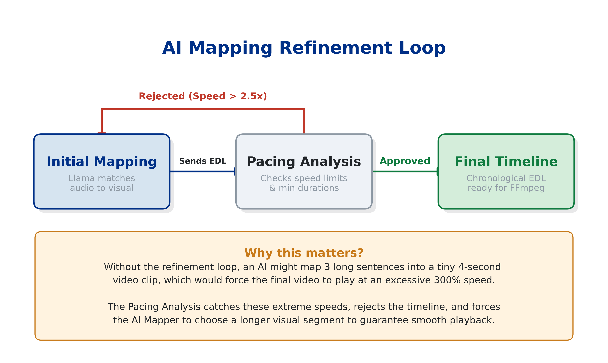
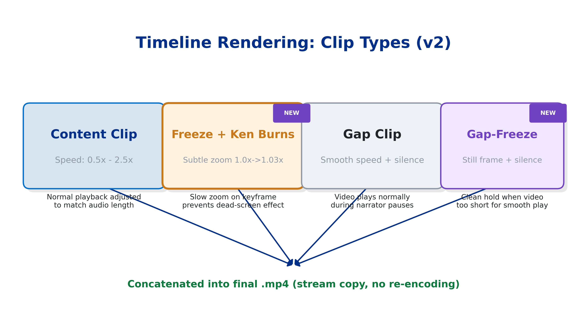

# Showtime Pipeline Architecture

Showtime's core objective is to take a raw, unedited screen recording and a separate voiceover audio file, and automatically edit them together into a perfectly paced, professional demo video.

Here is a step-by-step breakdown of exactly how the pipeline works:

---

## The 6-Step Processing Flow

### 1. Scene Detection (`scene_detector.py`)
**Goal:** Break the raw video down into logical visual segments.
- The pipeline scans the video at 2 frames per second using OpenCV.
- It calculates the pixel difference between consecutive frames to detect "scene changes" (e.g., clicking a new tab, opening a modal).
- A secondary histogram comparison catches color/layout changes that pixel diff misses.
- **Auto-split & Merge:** If a segment is too long (> 8s), it is scanned again with higher sensitivity to break it down further. If a segment is incredibly short (< 1.5s), it is merged into a neighboring segment to prevent visual flickering.
- **Idle Removal:** If nothing happens on screen for a while (no pixel changes), that segment is marked as `is_idle` and discarded entirely.
- **Keyframe Extraction:** For every valid segment, the exact middle frame is saved as a representative PNG "keyframe".
- **[v2] AI Verification Pass:** After OpenCV detection, ALL keyframes are batched into ONE Llama 4 Scout vision call. The model sees every screen and can confirm, merge, or split segments based on semantic content (not just pixel differences). For example, OpenCV might split a slowly-scrolling page into 3 segments, but the AI recognizes it's all one page and merges them. Each segment also receives a semantic tag (e.g., "landing_page", "code_editor", "settings_modal").

### 2. Frame Captioning (`frame_captioner.py`)
**Goal:** Understand what is happening visually in each segment.
- The keyframe PNG for each segment is analyzed.
- **OCR (Tesseract):** Extracts all readable text on the screen.
- **Structural Analysis:** Analyzes the UI density and layout.
- The output is a rich text description of the screen segment (e.g., "Screen showing GitHub repository with a green 'Code' button").
- These descriptions serve as fallback context when vision mapping isn't available.

### 3. Audio Transcription (`audio_analyzer.py`)
**Goal:** Understand the narrative and get exact timestamps for every spoken word.
- The voiceover audio file is processed using Groq's `whisper-large-v3-turbo` model.
- It provides a highly accurate transcript with **word-level timestamps**.
- The words are grouped together into localized "Voiceover Sentences" (e.g., Sentence 1: 0.5s - 4.2s: "Welcome to our new app.").

### 4. AI Mapping (`ai_mapper.py`)
**Goal:** Determine which visual segment should be shown on screen while the narrator is speaking a specific sentence.

**v2 Architecture: Single vision call with built-in self-critique.**

- **Primary: Vision Mapping (1 Groq call):** ALL keyframe images are batched into a single multimodal message alongside the full voiceover transcript. Llama 4 Scout sees every screen and intelligently matches sentences to visual content. The prompt includes duration awareness (the model checks if video segment duration fits the audio) and a self-critique section where the model rates its own pacing quality (0-10).
- **Optional Refinement (0-1 Groq call):** If the vision model's self-rated pacing_score falls below the threshold (default 8.5), one text-model refinement call is triggered. Llama 3.3 70B reviews the pacing analysis and adjusts extreme speeds.
- **Fallbacks:** Text-only mapping (Groq or Ollama) if no keyframes are available; chronological time-based mapping if all AI fails.
- **Action Assignment:** For each sentence, the AI decides if the video should `PLAY` (because an action is happening) or `FREEZE` (because the user needs time to read a static screen). Maximum 3 freezes per video.
- Each mapping includes a `confidence` score (0-1) and brief `reasoning` for debugging.

**Groq call budget: 1 vision call + 0-1 refinement = 1-2 calls (down from up to 5 in v1).**

### 5. Timeline Assembly (`timeline.py`)
**Goal:** Translate the AI's logical mapping into a frame-accurate Edit Decision List (EDL).
- The pipeline calculates exactly which milliseconds of the source video will be used for each voiceover sentence.
- **Proportional Splitting:** When multiple sentences share one segment, the video is divided proportionally by audio duration. Each sentence gets a sequential slice, advancing through the segment like a slow pan. Allocations are normalized to prevent overflow.
- **Audio > Video Handling:** When voiceover audio is longer than the source video, allocations are scaled down proportionally so the video plays through at a consistent slow speed rather than restarting or freezing randomly.
- **Auto-Freeze Guard:** If any clip ends up with zero video duration (segment exhausted), it is automatically converted to a freeze frame -- holding the last visible frame while the audio plays.
- **Gap Insertion:** If there is a natural pause in the voiceover (> 0.15s), the timeline inserts a "Gap Clip" to maintain audio continuity.

### 6. Video Rendering (`renderer.py`)
**Goal:** Generate the final MP4 file.
- The timeline is passed to FFmpeg to actually cut and paste the video together.
- For each clip in the timeline, the video is trimmed to match the exact duration of the voiceover audio it's paired with.
- **Adaptive Speed:** If the video segment is longer than the voiceover audio, it is sped up. If it is shorter, it is slowed down. Speed clamped to 0.5x-2.5x.
- **Auto-Freeze:** If a clip would need to be sped up beyond `2.5x` speed to fit (which looks choppy), the renderer switches to `FREEZE` mode.
- **[v2] Ken Burns Effect:** Freeze clips now apply a subtle slow zoom (1.0x to 1.03x) centered on the frame. This prevents the "dead screen" effect and keeps viewers engaged during static moments.
- **[v2] Gap-Freeze:** Gap clips where the video is too short for smooth playback (speed < 0.5x) now hold a clean still frame + silence, instead of playing extreme slow-motion that looks laggy.
- All individual clips are seamlessly concatenated together into the final `.mp4` output.

