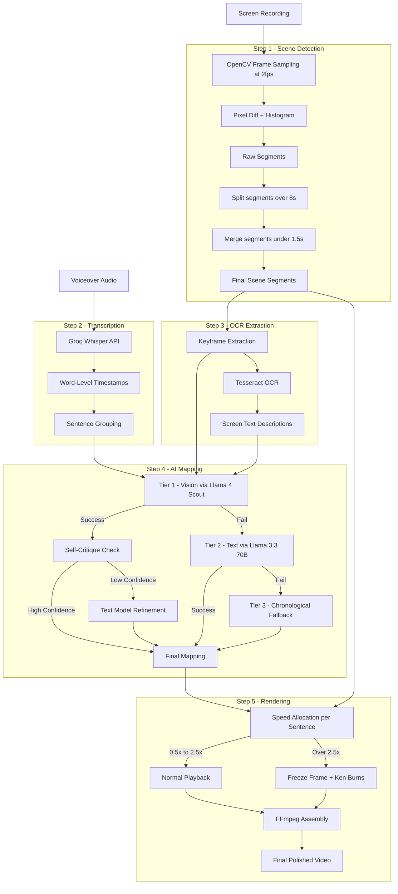

# Showtime — Interview Pitch

## Problem (One-Liner)

**Every developer records demos, but nobody wants to spend 30 minutes in a video editor syncing their screen recording with their voiceover.**

You record your screen. You record your narration. Now you need to cut the boring parts, speed up the slow parts, and make sure the right screen is visible when you say "look at the dashboard." That's tedious, manual, repetitive work.

---

## Solution (One-Liner)

**Showtime is an AI-powered pipeline that takes a raw screen recording + a voiceover and automatically produces a polished, perfectly-synced demo video — zero manual editing.**

---

## How It Works (30-Second Version)

1. **Detect** — Computer vision finds every scene change in the recording and throws away idle/boring parts
2. **Transcribe** — Whisper transcribes the voiceover with word-level timestamps
3. **Map** — AI vision looks at every screen and every sentence, then decides: "show THIS screen while the narrator says THAT"
4. **Render** — FFmpeg assembles the final video with adaptive speed, smooth transitions, and subtle zoom on static moments

---

## Architecture Diagram

---

## Tech Stack

| Layer | Tool | Why |
|-------|------|-----|
| Scene Detection | OpenCV | Industry standard, fast, no GPU needed |
| OCR | Tesseract | Free, accurate on screen text |
| Transcription | Groq Whisper | 10-50x faster than local Whisper, word-level timestamps |
| AI Mapping | Llama 4 Scout (vision) on Groq | Free, fast, sees actual screenshots |
| AI Fallback | Llama 3.3 70B (text) on Groq | Cheaper fallback when vision fails |
| Rendering | FFmpeg | The only serious option for programmatic video editing |
| Backend | FastAPI + Pydantic | Type-safe API with auto-generated docs |
| CLI | Typer + Rich | Beautiful terminal UX with zero boilerplate |

---

## Deep-Dive Questions & Answers

### "Why 2 FPS for scene detection?"

Screen recordings aren't action movies. The screen changes only when the user clicks, opens a tab, or scrolls — transitions that take at least 0.5 seconds. Sampling at 2fps checks every 500ms, which catches every meaningful transition.

- **Higher (4fps)** = double the memory and processing, same detected transitions
- **Lower (1fps)** = risks missing quick interactions like modal popups
- **2fps** = sweet spot, validated empirically against 10fps — same boundaries detected

Analogy: it's like polling vs. event-driven. You poll frequently enough to never miss an event, but not so often that you waste resources.

---

### "Why split segments longer than 8 seconds?"

An 8-second segment means 8 seconds of "no detected change." But demos have subtle activity — scrolling, typing, small UI updates — that pixel differencing misses at the primary threshold.

- The average spoken sentence is **3-5 seconds**
- A segment should cover **1-2 sentences** for good mapping granularity
- Beyond 8s, you're spanning 2+ sentences, so the mapper has poor choices: play too fast or too slow

The split pass re-scans long segments with a **lower sensitivity threshold** (20 vs 30) to catch those subtler transitions. It's a two-threshold system — aggressive globally to avoid noise, sensitive locally where we know something is probably happening.

---

### "Why merge segments shorter than 1.5 seconds?"

Sub-1.5s segments are almost always noise — cursor blinks, tooltip flashes, brief UI flickers. Keeping them creates jarring 1-second cuts that feel like visual glitches.

**1.5 seconds** is the minimum duration where a viewer can register what's on screen. Anything shorter gets absorbed into its neighbor.

Think of it like **debouncing in a UI** — you don't fire an event for every keystroke, you wait for a pause.

Exception: videos under 10 seconds skip merging entirely — every segment matters in short videos.

---

### "Why Llama 4 Scout for vision verification?"

Three reasons:

1. **Multimodal** — sees images AND reads text in one call. I batch all keyframes into a single request, and the model semantically understands screens (not just pixel diffs)
2. **Groq's speed** — custom LPU hardware runs inference in 2-3 seconds vs 10-15s on other providers. The pipeline needs to feel responsive
3. **Free tier** — the pipeline uses just 1-2 API calls total (batched images), so even Groq's free tier handles it

Why not GPT-4V or Claude Vision? Cost. One batched call with 5 images on GPT-4V costs $0.10-0.30. Llama 4 Scout on Groq is free. But the architecture is provider-agnostic — swapping is a config change.

---

### "How did you come up with the AI strategy (3-tier fallback)?"

I built it iteratively, each tier solving the previous tier's failure mode:

**Tier 3 (built first): Chronological mapping**
- Pure math. Sentence 1 plays over the first portion of video, sentence 2 over the next, proportionally
- Works always, zero API calls
- Problem: narrator says "look at the dashboard" while video shows the login page

**Tier 2 (added next): Text-based AI mapping**
- Send OCR descriptions + transcript to Llama 3.3 70B, let it match semantically
- Much better, but OCR misses visual context. A code editor and a settings page might have similar text but mean different things

**Tier 1 (final): Vision-based AI mapping**
- Let the AI actually *see* the screens + read the transcript
- Best quality, but depends on API availability and keyframe extraction

**The design principle: graceful degradation.** The system always produces output — it just gets progressively better with more resources. Like `font-family: Inter, Helvetica, sans-serif` in CSS.

Then I added **self-critique**: the vision model rates its own confidence (0-10). If it scores below 8.5, a cheaper text model reviews and adjusts the mapping. This cut API calls from 5 (v1) to 1-2 (v2) while improving quality.

---

### "What's the hardest technical problem you solved?"

**Audio-video sync when audio is longer than video.**

Imagine 135 seconds of narration over 40 seconds of screen recording. Naively, you'd need to play the video at 0.3x speed — unwatchably slow. Or you'd freeze randomly when segments run out.

My solution: **constrained proportional allocation.**

- Each sentence gets video time proportional to its audio duration
- A minimum clip duration (1s) prevents micro-clips
- But if enforcing minimums would overflow the segment, I detect this *before* allocating and disable minimums entirely
- If a segment is fully consumed, later sentences auto-convert to freeze frames (holding the last visible frame)
- The result: consistent pacing instead of random freezes

---

### "Why two methods for scene detection (pixel diff + histogram)?"

They catch different things:

| Method | Catches | Misses |
|--------|---------|--------|
| Pixel diff | New UI elements, text appearing, structural changes | Color/layout shifts where overall brightness stays similar |
| Histogram correlation | Dark mode toggle, page navigation, theme changes | Small localized changes (a button appearing) |

Using both with a **gating threshold** (histogram only fires when pixel diff shows *some* change) gives comprehensive detection without false positives.

---

### "What design patterns did you use?"

| Pattern | Where | Why |
|---------|-------|-----|
| **Pipeline** | Overall architecture | Each step is a pure function — easy to test, debug, and extend |
| **Strategy** | AI Mapper (3 tiers) | Graceful degradation, always produces output |
| **Self-Critique** | Vision mapping | AI rates itself, triggers refinement only when needed |
| **Observer** | `on_progress` callback | Decouples pipeline from UI — same code powers CLI and API |
| **Custom Exception Hierarchy** | Error handling | One base exception catches all pipeline failures, specific types for granular handling |

---

### "How do you ensure the final video isn't choppy?"

Four mechanisms:

1. **Speed clamping (0.5x-2.5x)** — below 0.5x looks frozen, above 2.5x is unwatchable
2. **Auto-freeze** — if speed would exceed 2.5x, switch to a still frame instead
3. **Ken Burns effect** — freeze frames get a subtle 1.0x to 1.03x zoom so the screen feels alive, not dead
4. **Gap-freeze** — pauses in narration hold a clean still frame instead of playing extreme slow-motion

---

### "What would you improve next?"

1. **Real-time preview** — let users see the mapping before rendering, adjust if needed
2. **Multi-speaker support** — handle videos with multiple narrators
3. **Transition effects** — cross-fades between scenes instead of hard cuts
4. **GPU acceleration** — use NVENC for rendering on machines with NVIDIA GPUs
5. **Smarter idle detection** — use AI to distinguish "loading spinner" (remove) from "user reading" (keep)

---

## Numbers to Remember

- **~2,650 lines** of production code across 11 modules
- **~165 tests** across 10 test files
- **1-2 API calls** per video (down from 5 in v1)
- **6-step pipeline**, each step independently testable
- **3-tier AI fallback** — always produces output
- Speed clamped to **0.5x-2.5x** for smooth playback
